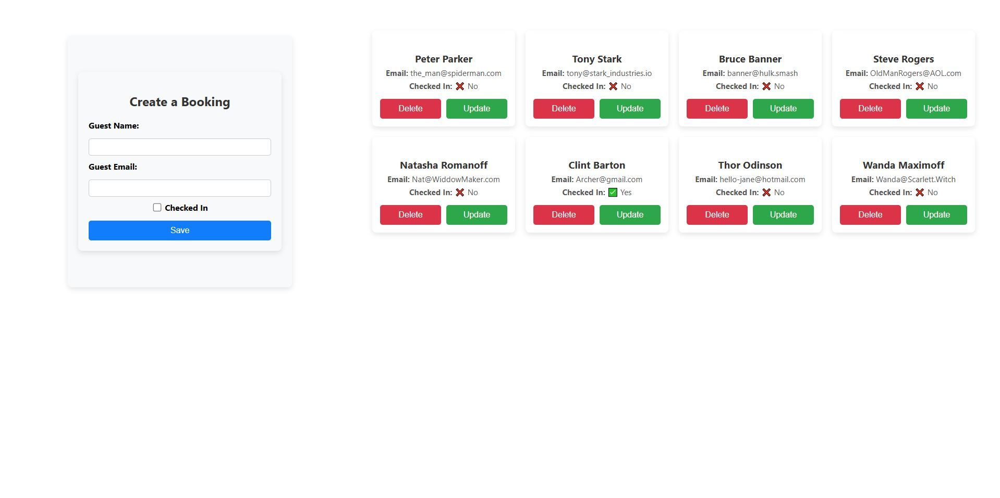
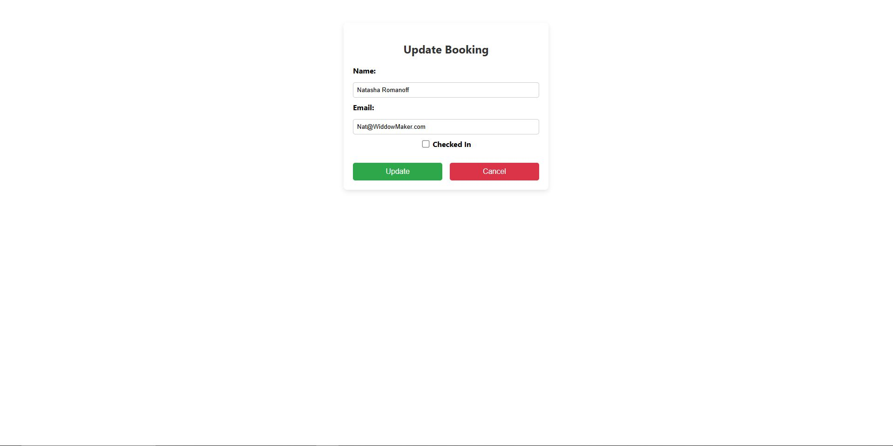

# Hotel Bookings

[](https://skillicons.dev)

Hotel Bookings is a full stack JavaScript application with an Express server and MongoDB database. This project creates Guest check-ins, and able to remove them from the system.

## Getting Started

These instructions will get the project up and running on your local machine for development purposes.

### Installing

Install dependencies in both the client and the server folders:

#### Client

```
cd client
npm install
```

#### Server

```
cd server
npm install
```

Seed the database.  Within the server folder:

```
npm run seeds
```

Run express (leave running in a terminal window).  Within the server folder:

```
npm run server:dev
```

Run React environment (leave running in a terminal window).  Within client folder:

```
npm start
```

The application is running on port 3000 so visit http://localhost:3000/.
The Server will listen on Port:9000


## UI

Home Page


Update Page
